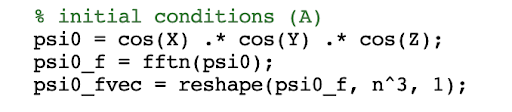
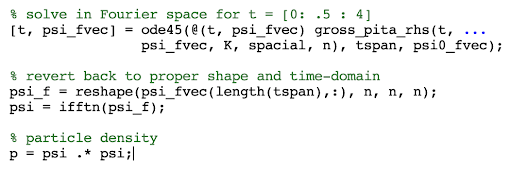
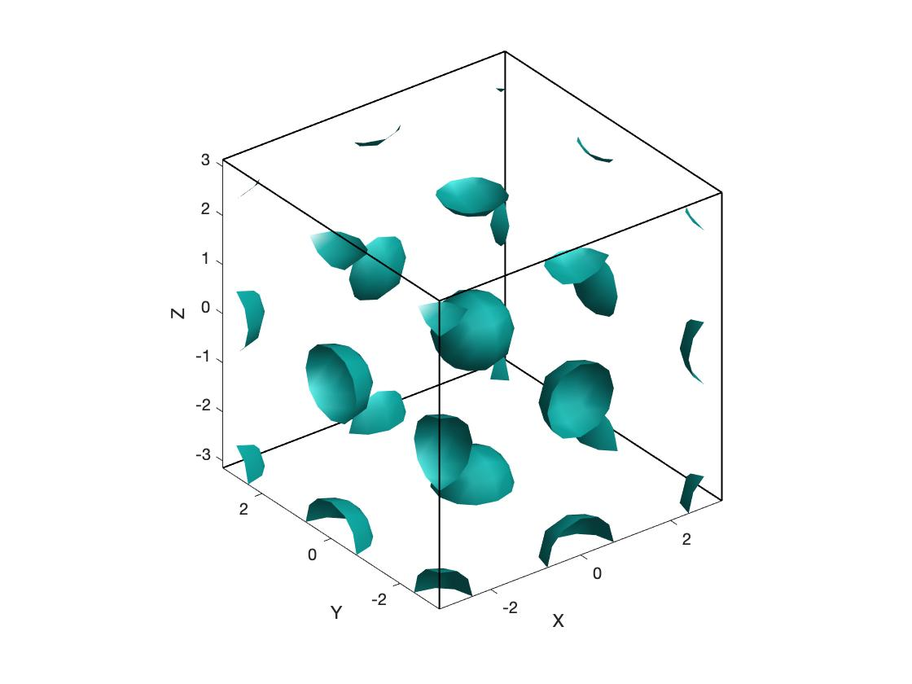
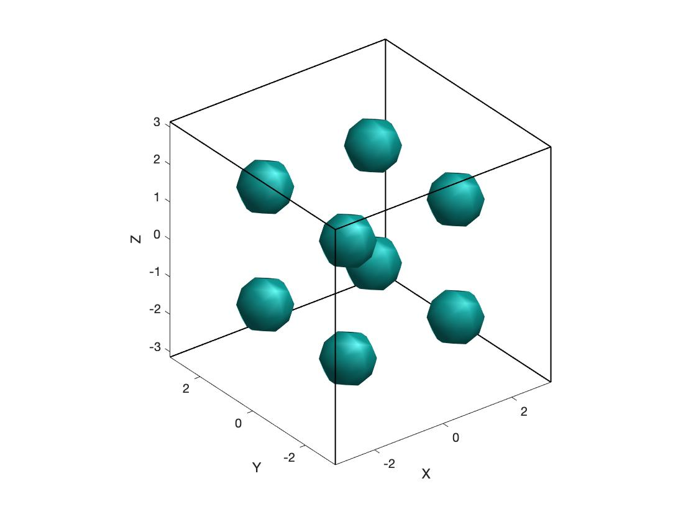

## Bose-Einstein Condensate 3D Simulation

Building off of ​Satyendra Nath Bose’s work with statistical understandings of photons,
Albert Einstein extended the idea of wave-particle duality to large particles, assigning them
corresponding de Broglie wavelengths. This understanding allowed for the existence of the
aptly-named Bose-Einstein Condensate (BEC), which occurs when bosonic atoms approach
absolute zero. This state of matter has been confirmed numerous times experimentally, and its
study continues to be a thriving field of research.
This condensed state of matter can be described with the Gross-Pitaevskii equation,
which combines a nonlinear Schrödinger equation with an approximation of potential interaction.
Because all the bosons in this system are in the same quantum state, as defined by the BEC, the
solution of this equation, ψ, represents the single wave function of the system.

![i\psi_t + \frac{1}{2}\nabla^2\psi - | \psi |^2\psi + [A_1 \sin^2(x) + B_1][A_2 \sin^2(y) + B_2][A_3 \sin^2(z) + B_3] \psi = 0 
](https://render.githubusercontent.com/render/math?math=%5Clarge+%5Cdisplaystyle+i%5Cpsi_t+%2B+%5Cfrac%7B1%7D%7B2%7D%5Cnabla%5E2%5Cpsi+-+%7C+%5Cpsi+%7C%5E2%5Cpsi+%2B+%5BA_1+%5Csin%5E2%28x%29+%2B+B_1%5D%5BA_2+%5Csin%5E2%28y%29+%2B+B_2%5D%5BA_3+%5Csin%5E2%28z%29+%2B+B_3%5D+%5Cpsi+%3D+0+%0A)

This system can be reformatted in a way to make it a first order derivative with respect to
time, incorporating both linear and nonlinear terms of ψ.

![i\psi_t = -i[\frac{1}{2}\nabla^2\psi - | \psi |^2\psi + [A_1 \sin^2(x) + B_1][A_2 \sin^2(y) + B_2][A_3 \sin^2(z) + B_3] \psi]
](https://render.githubusercontent.com/render/math?math=%5Clarge+%5Cdisplaystyle+i%5Cpsi_t+%3D+-i%5B%5Cfrac%7B1%7D%7B2%7D%5Cnabla%5E2%5Cpsi+-+%7C+%5Cpsi+%7C%5E2%5Cpsi+%2B+%5BA_1+%5Csin%5E2%28x%29+%2B+B_1%5D%5BA_2+%5Csin%5E2%28y%29+%2B+B_2%5D%5BA_3+%5Csin%5E2%28z%29+%2B+B_3%5D+%5Cpsi%5D%0A)

In order to implement this system numerically, A semi-spectral approach can be used to
solve the linear and nonlinear terms independently during each iteration of a time-stepping ODE
method. Within the function below, we will solve the nonlinear terms in the time domain, and
then combine it with the solved linear term, which is kept in the Fourier domain. Then we will
iterate this function in time using the Runge-Kutta 4th order method provided by MATLAB
function ODE45. Where ​ **K** ​ and ​ **spacial** ​ are 3D matrices previously evaluated outside of the
function. ​ **K** ​ represents the Laplace operator in Fourier space, and ​ **spacial** ​ represents the
space-based constants, which are not dependent on time.
From here, along with additional setup, we can utilize ODE45 to get a solution.
Specifically, we are simulating this equation for 4 seconds, along the [-π, π] domain in all three
spacial dimensions. We will solve with 2 different initial states, shown on the left, which are
evaluated over our 3-dimensional discretized domain. Then they will be transferred to Fourier

space to be compatible with our spectral function, and then reshaped into a vector to be
compatible with our ODE45 solver.

1. ψ(x, y, z) = cos(x) cos(y) cos(z)
2. ψ(x, y, z) = sin(x) sin(y) sin(z)

ODE45 then returns the solution, which needs to be reverted to the time-domain as a 3D matrix
to properly resemble the wave function of our problem. Squaring this solution gives us the
probability density of the particles.

The two isosurfaces below correspond to the probability densities of the bosons created
with our two different initial conditions. Because we are utilizing periodic boundary conditions,
the cosine solution is fragmented along the edges, but still resembles the array of 8 spheres
neatly displayed by the sine solution.

ψ(x, y, z) = cos(x) cos(y) cos(z)

ψ(x, y, z) = sin(x) sin(y) sin(z)

These solutions are relatively stable, not changing much over the span of the 4 second
interval used. They reflect what is already understood about particles in a Bose-Einstein
condensate: as almost all energy is removed from the system, the bosons gather together,
overlapping in the pockets of low potential energy represented by the spherical regions above.
